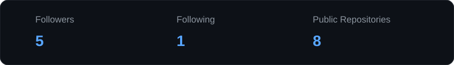
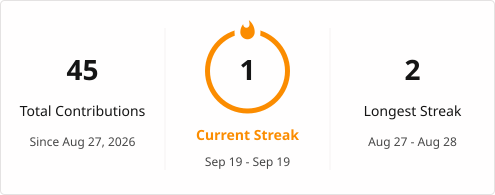

# Hi, I'm Seemal Imran

### Full-Stack Web Developer | Laravel & PHP 

  

---

## About Me

I'm a BS Information Technology student and Full-Stack Web Developer focused on building responsive, user-friendly and practical web applications.

I work with Laravel, PHP, MySQL, JavaScript, HTML, CSS, Tailwind CSS and Bootstrap.

I enjoy turning ideas into functional web experiences while continuously improving my development skills through projects, internships and hands-on development.

- Full-Stack Web Development
- Laravel & PHP Development
- Responsive Frontend Development
- MySQL Database Development
- JavaScript
- UI Development
- Authentication Systems
- E-commerce Web Applications

---

## Tech Stack

### Frontend

  

### Backend & Database

  

### Tools

  

---

## Featured Projects

### Aroma Valley

A responsive perfume website focused on clean frontend design, product presentation and user-friendly navigation.

**Tech:** HTML, CSS

[View Repository](https://github.com/seemalimran26/Aroma-Valley)

---

### AI Resume Screening

An AI-based resume screening project designed to analyze resumes and assist with candidate evaluation.

**Tech:** React, Firebase

[View Repository](https://github.com/seemalimran26/AI-Resume-Screening)

---

### Personal Portfolio

A personal portfolio website showcasing skills, projects, education and web development experience.

**Tech:** HTML, CSS, JavaScript

[View Repository](https://github.com/seemalimran26/Portfolio)

---

### TaskFlow Manager

A task management project designed for creating, organizing and managing tasks through a simple web interface.

**Tech:** HTML, CSS, JavaScript

[View Repository](https://github.com/seemalimran26/TaskFlowManager)

---

## Development Focus

  
  
  
  

  
  

---

## GitHub Analytics

  

  
  

  

---

## GitHub Activity

  

---

## Connect With Me

  

  

---

## Profile

  

  

  

---

  <b>Thanks for visiting my profile.</b>

  Building. Learning. Improving.

